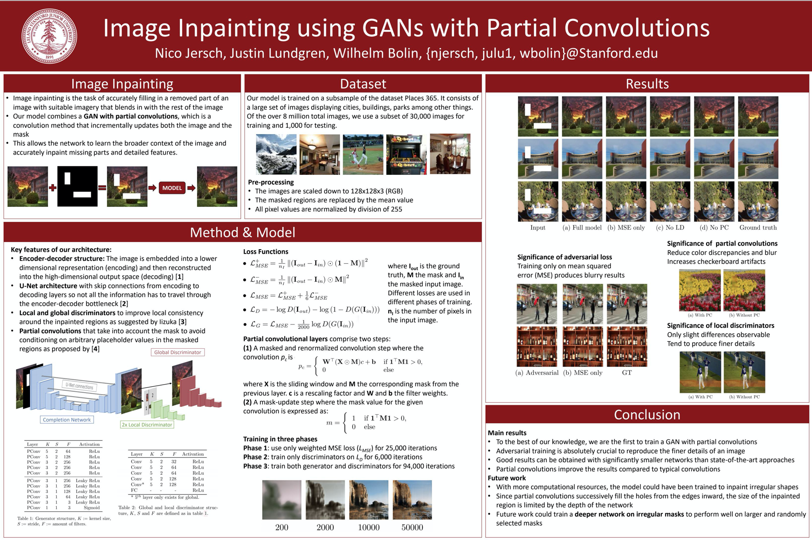

# Image Inpainting 
This repository is a copy of the original repository initially created by Nico Jersch (/njersch @ GitHub). The project was created for the Stanford course CS230, "Deep Learning" by Nico Jersch, Justin Lundgren, and me (Wilhelm Bolin). For this project, we built an agent who can repaint missing parts of pictures. 

A pdf of the report can be found here: http://cs230.stanford.edu/projects_winter_2019/reports/15812108.pdf
A poster of the project can be found here: http://cs230.stanford.edu/projects_winter_2019/posters/15812309.pdf

# Abstract 
We propose a Generative Adversarial Network (GAN) with partial convolutions for image inpainting. Using local and global discriminators, we show the importance of adversarial training to remove blur and produce cris details. We visualize how skip connections in a symmetric U-Net-like architecture allow our model to learn increasingly finer details of an image. It is demonstrated that very good results can be achieved even with significantly smaller networks than state-of-the-art approaches.  

The method we propose is comnbination of a Generative Adversarial Network (GAN) and partial convlution that was developed by NVIDIA (as seen here: https://github.com/NVIDIA/partialconv).

